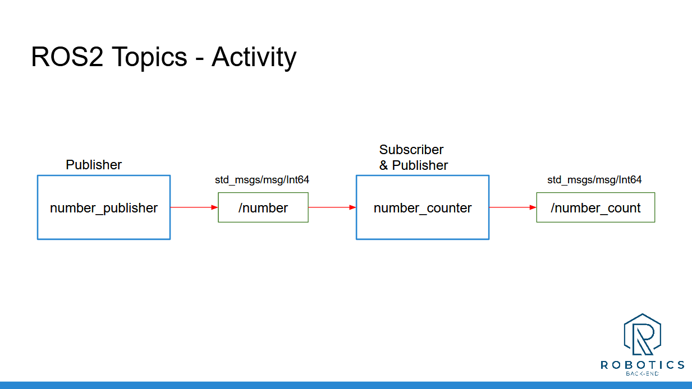

# ROS2 Number Publisher & Counter

This project demonstrates a simple ROS2 C++ system consisting of two nodes: `number_publisher.cpp` and `number_counter.cpp`.

- **number_publisher.cpp**: Publishes random numbers between 1 and 10 to the `/number` topic.
- **number_counter.cpp**: Subscribes to the `/number` topic and keeps track of how many times each number is published using a `std::unordered_map`. It then publishes this count to the `/number_count` topic.

## Project Structure



## Nodes

### 1. Number Publisher Node (`number_publisher.cpp`)
- This node generates random numbers in the range of 1-10.
- Publishes these numbers to the `/number` topic.

### 2. Number Counter Node (`number_counter.cpp`)
- Subscribes to the `/number` topic.
- Tracks how many times each number (1-10) is published using an `std::unordered_map`.
- Publishes the counts to the `/number_count` topic.

## Installation and Running the Project

1. **Clone the repository:**
    ```bash
    git clone <repository_url>
    cd <repository_directory>
    ```

2. **Build the workspace:**
    ```bash
    colcon build
    ```

3. **Source the environment:**
    ```bash
    source install/setup.bash
    ```

4. **Run the nodes:**

    - In one terminal, run the number publisher:
      ```bash
      ros2 run my_package number_publisher
      ```

    - In another terminal, run the number counter:
      ```bash
      ros2 run my_package number_counter
      ```

## Visual Overview

The project structure can be visualized as shown below:


## ROS2 Command Reference

For additional ROS2 commands and useful tips, refer to the `ROS2Notes.md` file included in the project.

---

Feel free to explore the project and customize the nodes for more complex functionality!

